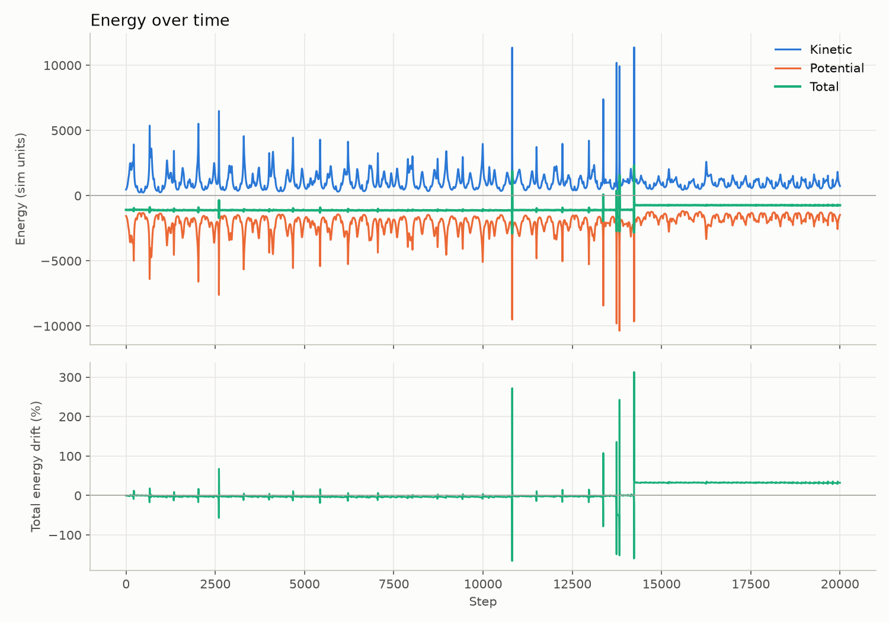
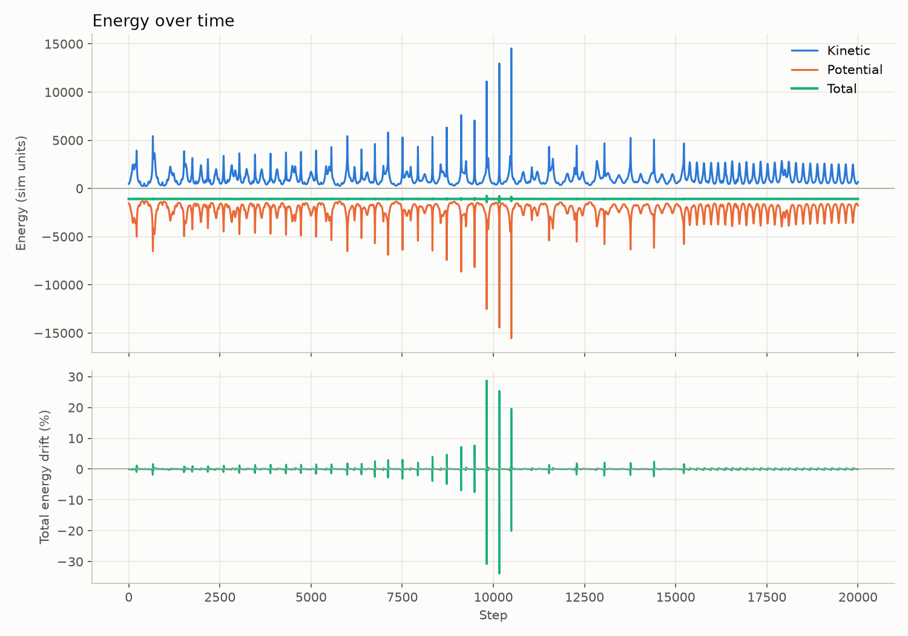

# Solar System Simulator

A 2D N-body gravity simulator built in Python with Pygame and NumPy. Every planet pulls on every other planet, so orbits aren't scripted: they emerge from Newton's law of gravitation, integrated step by step in real time.

<!-- Add a short GIF of the simulation running here, e.g.  -->

## Features

- **N-body gravity**: each planet feels the pull of the Sun *and* every other planet, so orbits perturb each other over time.
- **Semi-implicit (symplectic) Euler integration**: keeps orbital energy stable over long runs, where plain Euler would make orbits spiral outward.
- **Plummer softening**: prevents the force from blowing up to infinity when two bodies pass very close.
- **Substepping**: 10 physics steps per rendered frame for accuracy during close encounters, without lowering the frame rate.
- **Orbital trails**: each planet draws its last 1,000 positions.
- **Energy conservation check**: a separate headless script runs the simulation and plots kinetic, potential, and total energy over time to verify the integrator.

## How it works

### Gravity

The acceleration on body *i* is the sum of the pulls from every other body *j*:

$$
\mathbf{a}_i = \sum_{j \ne i} \frac{G\, m_j\, (\mathbf{r}_j - \mathbf{r}_i)}{\left(|\mathbf{r}_j - \mathbf{r}_i|^2 + \varepsilon^2\right)^{3/2}}
$$

This is Newton's law of gravitation written as a vector, with one change: the softening term $\varepsilon^2$ in the denominator. Without it, the force grows as $1/r^2$, so two bodies passing very close produce a huge acceleration that flings them apart unrealistically. Adding $\varepsilon^2$ caps the force at short range and leaves it essentially unchanged at normal distances (Plummer softening).

The Sun is held fixed at the centre of the screen as a deliberate simplification, so the system doesn't drift around the window. All planets still attract each other.

### Integration

Positions and velocities are stored as NumPy vectors and updated each step with **semi-implicit Euler**:

$$
\mathbf{v}_{n+1} = \mathbf{v}_n + \mathbf{a}_n\,\Delta t \qquad
\mathbf{x}_{n+1} = \mathbf{x}_n + \mathbf{v}_{n+1}\,\Delta t
$$

The only difference from regular Euler is the order: velocity is updated first, and the *new* velocity is used to move the body. That small change makes the method **symplectic**. It doesn't conserve energy exactly, but the error oscillates around the true value instead of growing every orbit, so planets don't slowly spiral out.

### Substepping

Each rendered frame runs 10 physics substeps with $\Delta t = 0.1$ instead of a single step with $\Delta t = 1$. The simulation runs at the same speed on screen, but each step is 10× smaller, which matters most during close encounters when accelerations change quickly.

## Energy conservation check

A closed gravitational system should keep its total energy (kinetic + potential) constant, which makes total energy a good test for whether the integrator is working. `energy.py` runs 20,000 steps without opening a window and plots:

- kinetic energy: $\sum \tfrac{1}{2} m v^2$
- potential energy, using the same softening as the force: $-\sum_{i<j} \dfrac{G\, m_i m_j}{\sqrt{r_{ij}^2 + \varepsilon^2}}$
- total energy, and its drift as a percentage of the starting value

**Before substepping** (1 step per frame): a close encounter around step 14,000 permanently shifts the total energy by roughly 30%. One step was too coarse to resolve the encounter, so the integrator injected energy that never came back.



**After substepping** (10 steps per frame): close encounters still cause brief spikes, but the total energy returns to its starting value afterward. The drift at the end of the run is under 1%.



The remaining spikes line up with the sharpest peaks in kinetic energy, which are the closest passes. That's where a fixed timestep struggles most, and it's what an adaptive timestep would address (see Roadmap).

## Project structure

| File | Purpose |
|---|---|
| `main.py` | Pygame window, main loop, rendering, and trails |
| `physics.py` | Gravity calculation and semi-implicit Euler update |
| `bodies.py` | `Body` class and the initial set of bodies |
| `constants.py` | Tunable simulation parameters |
| `energy.py` | Headless energy conservation check and plot |

## Running it

Requires Python 3.13 (other recent 3.x versions should also work).

```bash
pip install pygame numpy matplotlib
python main.py      # run the simulation
python energy.py    # run the energy check and save energy.png
```

## Configuration

All parameters live in `constants.py`. The simulation uses its own units rather than SI, so values are chosen to give visible orbits on a 1280×720 window.

| Constant | Default | Effect |
|---|---|---|
| `G` | 0.25 | Gravitational constant |
| `SUN_MASS` | 10000 | Mass of the central body |
| `epsilon` | 5 | Softening length; larger values smooth out close encounters |
| `SUBSTEPS` | 10 | Physics steps per frame; higher is more accurate but slower |
| `TRAIL_NUM` | 1000 | Number of past positions drawn per trail |

Initial positions, velocities, masses, and colours are set in `create_bodies()` in `bodies.py`.

## Roadmap

- [ ] Pause and resume
- [ ] Interactive mass manipulation (change a body's mass while the simulation runs)
- [ ] Orbital perturbation (nudge a planet and watch the system respond)
- [ ] Adaptive timestep for close encounters
- [ ] Vectorize the force loop with NumPy to scale to many more bodies

## Tech

- Python 3.13
- Pygame for rendering and the main loop
- NumPy for vector maths
- Matplotlib for the energy plots
